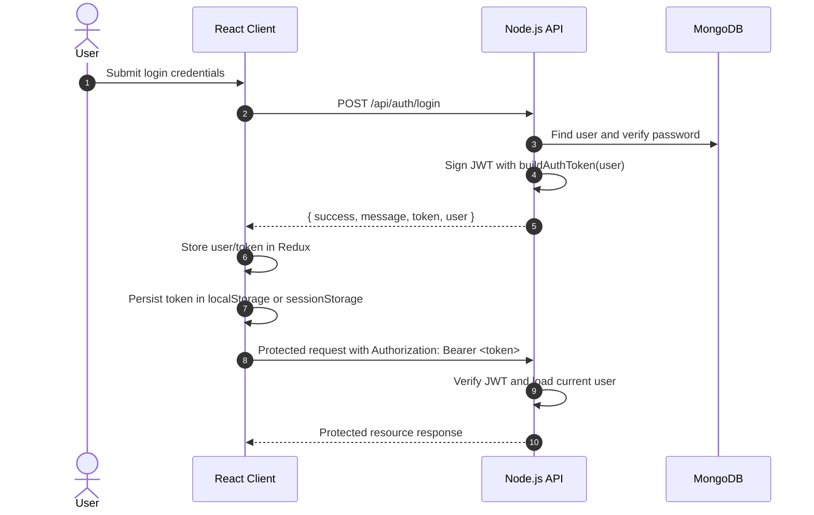
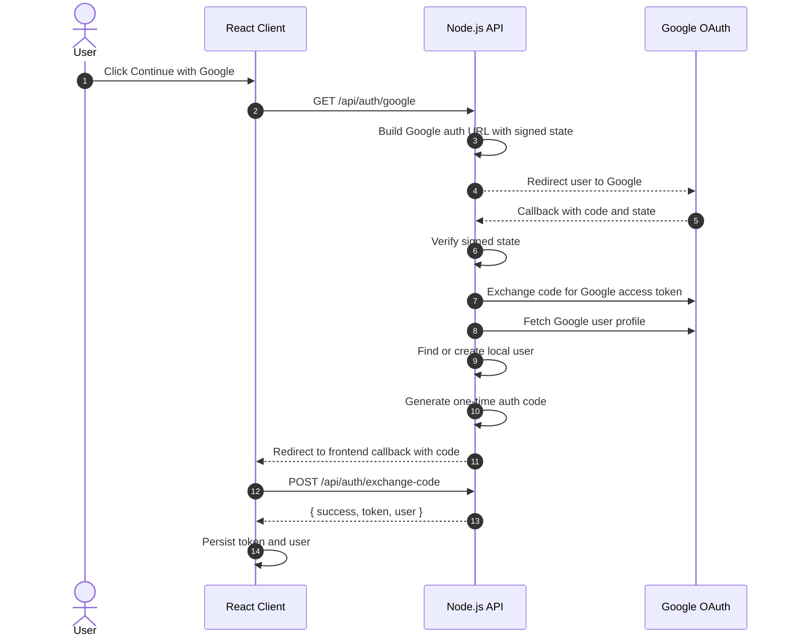

# Identity, Authentication & RBAC Module

## 1. Executive Summary & Domain Scope

The **Identity & Authentication** module is the security perimeter for the SkillsSphere-AI platform. It establishes authenticated user sessions with JWTs, enforces Role-Based Access Control (RBAC), supports email verification and password reset OTP flows, and integrates Google OAuth.

### Core Problem Addressed

SkillsSphere-AI serves multiple user personas, including students, tutors, recruiters, and administrators. Each role has different access boundaries, so authentication and authorization are centralized through backend middleware and frontend auth state management.

### Target User Personas

- **All Users**: Need registration, login, email verification, logout, and protected route access.
- **Students, Tutors, Recruiters, and Admins**: Need role-aware access to protected platform features.
- **System Administrators**: Need consistent authentication controls and auditable login/logout behavior.

### High-Level Capability Matrix

**What the Module Does:**

- **JWT Session Management**: The backend signs a JWT and returns it in API responses for registration, login, email verification, Google login, and OAuth code exchange.
- **Client Token Persistence**: The React client stores the JWT and user payload in browser storage. When `rememberMe` is true, it uses `localStorage`; otherwise it uses `sessionStorage`.
- **Bearer Token Authentication**: Protected API calls send the JWT in the `Authorization: Bearer <token>` header.
- **Google OAuth**: Supports Google OAuth redirect flow using signed state and a one-time auth code exchange so the JWT is not exposed in the callback URL.
- **Email Verification and Password Reset OTPs**: Stores hashed OTP values on the user document with expiration timestamps and attempt limits.
- **Granular RBAC**: Enforces role boundaries through Express middleware before protected controller logic runs.

**What the Module Does Not Currently Implement:**

- **HttpOnly Cookie Token Storage**: Auth JWTs are not currently stored in `HttpOnly` cookies.
- **Rotating Refresh Tokens**: The implementation issues a single JWT and does not implement a separate refresh-token rotation flow.
- **Silent Refresh Endpoint Flow**: Clients reauthenticate after token expiration rather than using a refresh-token endpoint.

---

## 2. Authentication Architecture

The current implementation separates token issuing, token persistence, and token validation:

- `server/src/modules/auth/service.js` signs JWTs with `buildAuthToken`.
- `server/src/modules/auth/controller.js` returns `{ success, token, user }` from auth endpoints that issue sessions.
- `client/src/features/auth/authSlice.ts` stores the token and user in Redux state and persists them to browser storage.
- `client/src/utils/authToken.ts` reads the token from `localStorage` first and then `sessionStorage`.
- `server/src/middleware/authMiddleware.js` validates protected requests by reading the bearer token from the `Authorization` header.

### Login and Token Storage Flow



### Google OAuth Redirect Flow



---

## 3. Token Behavior

### JWT Issuing

`buildAuthToken(user)` signs a JWT containing:

- `userId`
- `role`
- `jti`, a random token identifier used for logout blacklisting

The JWT is signed with `process.env.JWT_SECRET`. The expiration is configured by `process.env.JWT_EXPIRES_IN`; when that environment variable is not set, the default is `7d`.

### Client Persistence

The client persists auth state under these keys:

- `skillssphere.auth.token`
- `skillssphere.auth.user`
- `skillssphere.auth.pendingEmail`

`persistAuth({ token, user }, rememberMe)` chooses the storage location:

- `localStorage` when `rememberMe` is true.
- `sessionStorage` when `rememberMe` is false.

On startup, the client reads stored auth from `localStorage` first and then `sessionStorage`. If a valid stored token and user are found, Redux initializes as authenticated.

### Logout and Revocation

Logout sends the current JWT as a bearer token. The backend decodes the token and, when it contains `jti` and `exp`, adds that token identifier to the blacklist. The client clears local auth state and removes stored token/user values from both `localStorage` and `sessionStorage`.

---

## 4. API Endpoints & State Management

### REST Endpoints

| Method | Endpoint | Auth Level | Purpose | Payload | Response |
| :--- | :--- | :--- | :--- | :--- | :--- |
| `POST` | `/api/auth/register` | Public | Creates a local account and starts or skips email verification based on email service mode. | `{ name, email, password, role }` | `{ success, message, token, user }` |
| `POST` | `/api/auth/login` | Public | Verifies local credentials and issues a JWT. | `{ email, password }` | `{ success, message, token, user }` |
| `POST` | `/api/auth/verify-email` | Public | Validates the email verification OTP and issues a JWT. | `{ email, otp }` | `{ success, message, token, user }` |
| `POST` | `/api/auth/resend-otp` | Public | Sends or queues a new verification OTP response without revealing account state. | `{ email }` | `{ success, message }` |
| `POST` | `/api/auth/forgot-password` | Public | Starts password reset OTP flow. | `{ email }` | `{ success, message }` |
| `POST` | `/api/auth/reset-password` | Public | Validates password reset OTP and updates the password. | `{ email, otp, newPassword }` | `{ success, message }` |
| `GET` | `/api/auth/google` | Public | Starts Google OAuth redirect flow. | Query parameters such as `role` and `redirect` | Redirect to Google |
| `GET` | `/api/auth/google/callback` | Public | Handles Google callback and redirects frontend with a one-time auth code. | `?code=...&state=...` | Redirect to frontend callback |
| `POST` | `/api/auth/exchange-code` | Public | Exchanges the one-time OAuth auth code for the app JWT. | `{ code }` | `{ success, token, user }` |
| `POST` | `/api/auth/google` | Public | Verifies a Google ID token and issues an app JWT. | `{ token }` | `{ success, message, token, user }` |
| `GET` | `/api/auth/me` | Bearer token | Returns the current authenticated user. | None | `{ success, user }` |
| `POST` | `/api/auth/logout` | Bearer token | Blacklists the current JWT when possible. | None | `{ success, message }` |

### Redux State Management

The frontend stores the current auth session in Redux:

```typescript
const initialState = {
  user: storedAuth.user,
  token: storedAuth.token,
  isAuthenticated: Boolean(storedAuth.token && storedAuth.user),
  pendingVerificationEmail: readPendingEmail(),
  pendingUser: null,
  loading: false,
  verificationLoading: false,
  resendLoading: false,
  error: null,
};
```

Successful login, registration auto-verification, email verification, and OAuth code exchange set the token and user in Redux. Logout and failed current-user fetches clear both Redux and browser storage.

---

## 5. Security, Edge Cases & Error Handling

### Browser Storage Tradeoffs

The current implementation stores JWTs in `localStorage` or `sessionStorage`, not in `HttpOnly` cookies. This means browser JavaScript can read the token, which makes XSS prevention especially important. The benefit is that the browser does not automatically attach the token to every request the way it would with cookies, reducing the default CSRF exposure for token-authenticated API calls. A future cookie-based design would have different tradeoffs and would need explicit CSRF protections.

### Token Expiration

JWT expiration is controlled by `JWT_EXPIRES_IN` on the server. If the variable is not configured, tokens expire after `7d`. When a token expires, protected middleware rejects it with an authentication error and the user must log in again.

### Token Blacklisting on Logout

JWTs include a `jti`. During logout, the backend attempts to blacklist that `jti` until the token's `exp` time. Protected routes reject blacklisted tokens.

### Password Change Invalidation

Protected route middleware compares the token issue time against `passwordChangedAt`. If the password was changed after the token was issued, the request is rejected and the user must log in again.

### OTP Attempt Limits

Email verification and password reset use hashed OTP values with expiration timestamps. The implementation tracks OTP attempts on the user document and rejects requests after the configured maximum attempt count.

### OAuth State Protection

Google OAuth state is signed with `OAUTH_STATE_SECRET`, includes a nonce and issued-at timestamp, and is rejected if the signature is invalid or the state is too old. Redirect paths are normalized and constrained to known frontend paths to reduce open redirect risk.

---

## 6. Component-Level Implementation Notes

### `client/src/features/auth/authSlice.ts`

The auth slice owns session state, persistence, login/logout thunks, email verification state, and current-user fetch behavior. It writes auth data through `persistAuth` and clears both browser storage locations on logout.

### `client/src/utils/authToken.ts`

`getToken()` reads `skillssphere.auth.token` from `localStorage` first, then falls back to `sessionStorage`.

### `client/src/services/apiClient.ts`

When a token is provided to `apiRequest`, the client sends it as:

```http
Authorization: Bearer <token>
```

### `server/src/modules/auth/service.js`

`buildAuthToken(user)` creates the JWT. Registration, login, Google login, and OAuth code exchange call this token builder and return the token through their controller responses.

### `server/src/middleware/authMiddleware.js`

The `protect` middleware reads the bearer token, verifies it with `JWT_SECRET`, checks token blacklist state, loads the current user, checks password-change invalidation, and attaches the user document to `req.user`.
